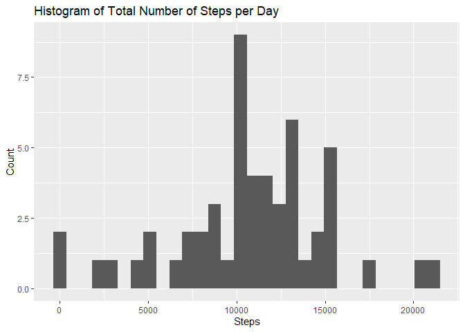
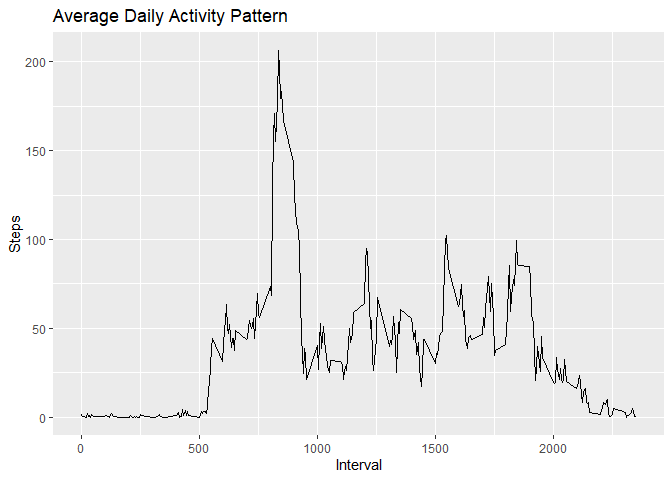
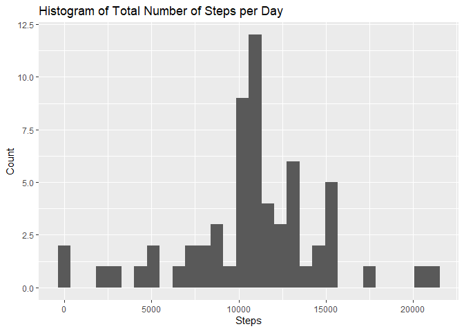
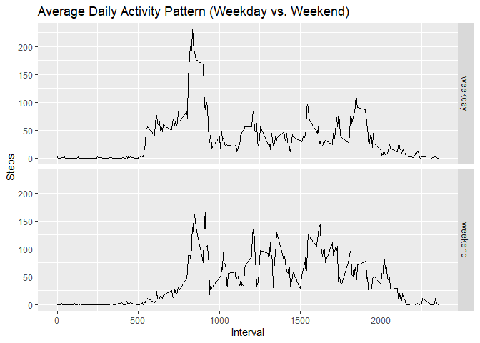

## Loading and preprocessing the data
First we load the relevant libraries we need in order to answer the questions presented. ```dplyr``` is needed to group data and ```ggplot2``` is needed to plot the results.

```r
library(dplyr)
```

```
## 
## Attaching package: 'dplyr'
```

```
## The following objects are masked from 'package:stats':
## 
##     filter, lag
```

```
## The following objects are masked from 'package:base':
## 
##     intersect, setdiff, setequal, union
```

```r
library(ggplot2)
```

### Load the data
We first load the data into a data frame using ```read.csv```.

```r
activity <- read.csv("./activity.csv")
```

### Process/transform the data (if necessary) into a format suitable for your analysis
We then convert the dates in the dataset from strings into usable dates instead of strings, while also eliminating any data that contains missing values.

```r
activity$date <- as.Date(activity$date)
activityreal <- activity[complete.cases(activity), ]
```

## What is mean total number of steps taken per day?

### Calculate the total number of steps taken per day
We first group the dataset by date in order to make it easier to work with.

```r
activityperday <- group_by(activityreal, date)
```
We then sum up the total steps taken per day and save those values into a dataframe.

```r
sumactperday <- aggregate(steps ~ date, activityperday, sum)
```

### Make a histogram of the total number of steps taken each day
We use the ```qplot``` function in order to make a quick plot to illustrate the total number of steps taken per day.

```r
qplot(sumactperday$steps, xlab = "Steps", ylab = "Count", main = "Histogram of Total Number of Steps per Day", bins = 30)
```

<!-- -->

### Calculate and report the mean and median of the total number of steps taken per day
We then calculate the mean and median of the total number of steps taken per day by simply utilizing the ```mean``` and ```median``` functions as demonstrated below:

```r
mean(sumactperday$steps)
```

```
## [1] 10766.19
```

```r
median(sumactperday$steps)
```

```
## [1] 10765
```

## What is the average daily activity pattern?
### Make a time series plot (i.e. type = "l") of the 5-minute interval (x-axis) and the average number of steps taken, averaged across all days (y-axis)
We start by grouping the dataset by interval.

```r
actbyinterval <- group_by(activityreal, interval)
```
Then we use the ```aggregate``` function to find the average number of steps taken across all days.

```r
sumactbyint <- aggregate(steps ~ interval, actbyinterval, mean)
```
We can then use ```ggplot``` to construct the time series plot shown below:

```r
ggplot(sumactbyint, aes(interval, steps)) +
  geom_line() +
  xlab("Interval") +
  ylab("Steps") +
  ggtitle("Average Daily Activity Pattern")
```

<!-- -->

### Which 5-minute interval, on average across all the days in the dataset, contains the maximum number of steps?
We can find the 5-minute interval by utilizing the ```which.max``` function and using that to index as shown below:

```r
sumactbyint$interval[which.max(sumactbyint$steps)]
```

```
## [1] 835
```
## Imputing missing values
### Calculate and report the total number of missing values in the dataset (i.e. the total number of rows with NAs)
We can find the number of missing rows by simply subtracting the rows of the subset we used from the original dataset.

```r
nrow(activity)-nrow(activityreal)
```

```
## [1] 2304
```
### Devise a strategy for filling in all of the missing values in the dataset. The strategy does not need to be sophisticated. For example, you could use the mean/median for that day, or the mean for that 5-minute interval, etc.
The strategy we will be utilizing is substituting the mean for the 5-minute interval for any missing value due to the fact that some days contain less usable data points than others and can have a big impact on how the end result looks. 

### Create a new dataset that is equal to the original dataset but with the missing data filled in.
We begin by cloning the data frame in order to preserve the original dataset. We use ```cbind``` in order to add the means to the original data frame.

```r
activitymissing <- activity
actcombined <- cbind(activitymissing, sumactbyint)
```
The lines below are used to tidy up the new data frame.

```r
actcombined <- actcombined[c(1:3,5)]
names(actcombined)[4] <- "mean"
```
We then index and replace the missing values.

```r
ismissing <- is.na(actcombined$steps)
actcombined$steps[ismissing] <- actcombined$mean[ismissing]
```
We finally then sum up the total steps taken per day and save those values into a dataframe.

```r
sumactcombined <- aggregate(steps ~ date, actcombined, sum)
```

### Make a histogram of the total number of steps taken each day and Calculate and report the mean and median total number of steps taken per day. Do these values differ from the estimates from the first part of the assignment? What is the impact of imputing missing data on the estimates of the total daily number of steps?
We can then use ```qplot``` to plot the new histogram.

```r
qplot(sumactcombined$steps, xlab = "Steps", ylab = "Count", main = "Histogram of Total Number of Steps per Day", bins = 30)
```

<!-- -->

Similarly to before, we use the ```mean``` and ```median``` functions to find the new mean and medians

```r
mean(sumactcombined$steps)
```

```
## [1] 10766.19
```

```r
median(sumactcombined$steps)
```

```
## [1] 10766.19
```
We can see that while the averages stayed the same the median of the imputed data was different increased to match the mean. This is demonstrated in the histograms as well, as we can see a larger portion of the histogram has shifted higher.

## Are there differences in activity patterns between weekdays and weekends?

### Create a new factor variable in the dataset with two levels – “weekday” and “weekend” indicating whether a given date is a weekday or weekend day.
We begin by  using the ```weekdays``` function in order to find the day of the week for each date. We append this to the data frame using cbind to make the data frame reflect this.

```r
day <- weekdays(actcombined$date)
actcombined <- cbind(actcombined, day)
```
We then use the ```ifelse``` function in order to fill the new factor variable by denoting whether the day of the week falls under the category 'weekday' or 'weekend'.

```r
actcombined$type <- ifelse(actcombined$day %in% c("Saturday","Sunday"), "weekend", "weekday")
```
Then we use the ```aggregate``` function to find the average number of steps taken across all days sorted by type (of day of the week).

```r
sumactbytype <- aggregate(steps ~ interval + type, actcombined, mean)
```

### Make a panel plot containing a time series plot (i.e. type = "l") of the 5-minute interval (x-axis) and the average number of steps taken, averaged across all weekday days or weekend days (y-axis). See the README file in the GitHub repository to see an example of what this plot should look like using simulated data.
We then make a panel plot using the code below: 

```r
ggplot(sumactbytype, aes(interval, steps)) +
  geom_line() +
  xlab("Interval") +
  ylab("Steps") +
  ggtitle("Average Daily Activity Pattern (Weekday vs. Weekend)")+
  facet_grid(type ~ .)
```

<!-- -->

We can see from the panel plot that activity is significantly more spread out throughout the day on weekends vs. weekday. While weekdays have sharper spikes and lower troughs possibly because of ones commute and work schedule.
